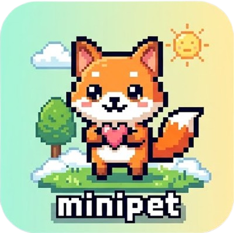

# MiniPet 🐾

A delightful desktop companion that lives on your screen, helps you stay focused with Pomodoro, and even "eats" your unwanted files!



## 🌟 Key Features

- **Interactive Companions**: Multiple pet instances can live on your screen simultaneously.
- **Custom Pet Import**: Easily import your own custom characters! Just provide a spritesheet and a simple JSON config to bring your own art to life.
- **File Eating System**: Drag and drop files or folders onto your pet to move them to the Trash/Recycle Bin.
- **Pomodoro Timer**: Stay productive with a built-in focus timer that communicates through your pet.
- **Stay-on-Top**: Your pets stay visible above other windows without interfering with your work.
- **Smart Click-Through**: Pets are normally click-through so you can interact with apps behind them, but they "wake up" when you hover over them.

## 🚀 Getting Started

### Prerequisites
- [Node.js](https://nodejs.org/) (v16 or higher)
- npm or yarn

### Installation
1. Clone the repository:
   ```bash
   git clone https://github.com/yourusername/minipet.git
   cd minipet-app
   ```

2. Install dependencies:
   ```bash
   npm install
   ```

3. Run in development mode:
   ```bash
   npm start
   ```

### Building for Production
To create a distributable installer for your OS:
```bash
npm run make
```
The output will be in the `out/make` directory.

## 🛠 Technical Stack
- **Framework**: [Electron](https://www.electronjs.org/)
- **Bundler**: [Vite](https://vitejs.dev/) via Electron Forge
- **Language**: TypeScript
- **Graphics**: HTML5 Canvas & Vanilla CSS

## ⚠️ Important Note for macOS Users
If you distribute the `.dmg` file without an Apple Developer certificate, users will see a "Damaged" or "Unidentified Developer" warning.

**To fix this, users should run the following command in Terminal:**
```bash
sudo xattr -cr /Applications/MiniPet.app
```

## 🎨 Adding Custom Pets
MiniPet supports custom animations!
1. Create a folder in `src/assets/default-pets/`.
2. Add a `spritesheet.png` and a `pet.json` defining the animation frames.
3. Restart the app to see your new friend!

## ⚖️ Disclaimer
This application only provides tools; we do not own and are not responsible for content/images uploaded by users or linked from external sources.

## 📄 License
This project is licensed under the MIT License - see the [LICENSE](LICENSE) file for details.

---
Created with ❤️ by [QBao](mailto:lehoquocbao9@gmail.com)
